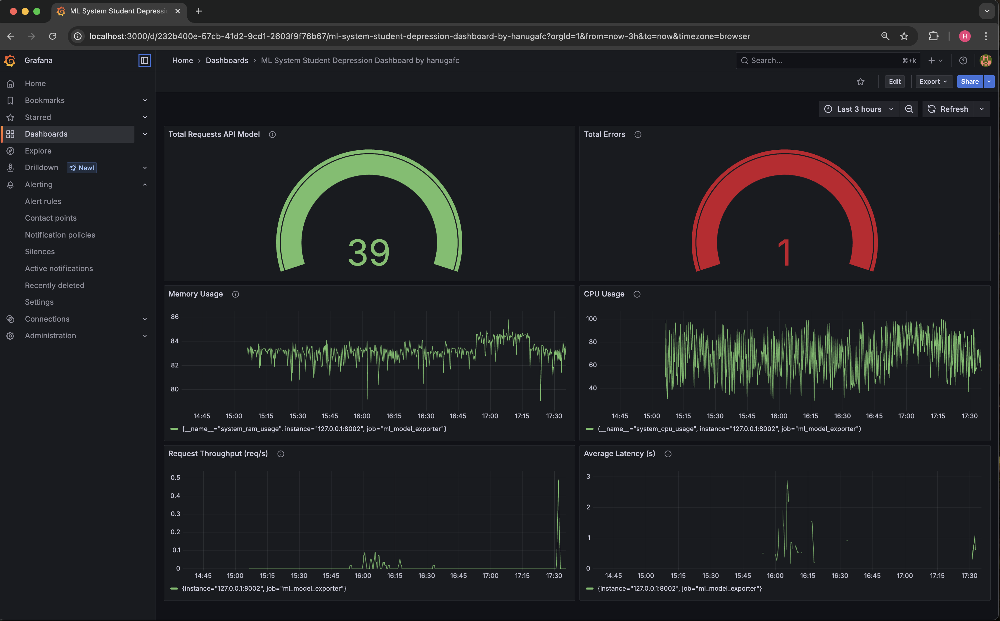
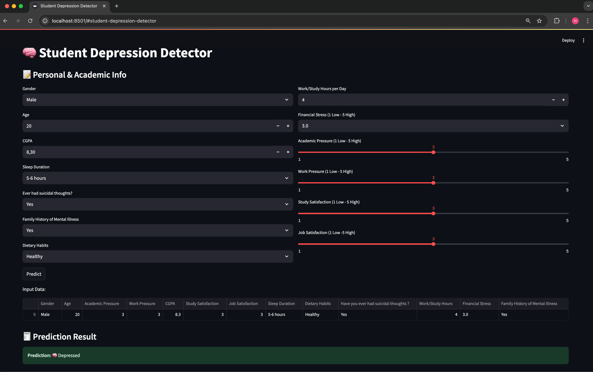

# ML System: Student Depression Detection Dashboard
**Author:** hanugafc  
**Stack:** FastAPI · Redis · MLflow · Streamlit · Prometheus · Grafana

---

## 📘 Overview

This project is a complete machine learning system for detecting signs of student depression based on user input. It integrates multiple components to enable scalable inference, real-time monitoring, and a user-friendly interface.

It includes:
- A **Streamlit app** for user input and prediction visualization
- A **FastAPI backend** for queuing inference requests
- A **Redis queue** for managing asynchronous jobs
- A **worker** service to preprocess inputs, call the model, and return results
- An **MLflow model server** to handle predictions
- **Prometheus & Grafana** for monitoring system performance and model health

---

## 🚀 Features

- 🧠 Predicts student depression based on normalized and encoded inputs
- ⚙️ Asynchronous job processing via Redis
- 🔎 Real-time monitoring with Prometheus and Grafana
- 📈 Inference throughput, latency, error rate, CPU/RAM usage tracking
- 📊 Ready-to-use Grafana dashboard:  
  **_ML System Student Depression Dashboard by hanugafc_**

---

## 📂 Project Structure Overview

```

ML-System-StudentDepression/
│
├── ml-model-serving-monitoring/
│   └── app/
│       ├── app.py               # Streamlit app
│       ├── fastapi_server.py    # FastAPI inference request handler
│       ├── worker.py            # Background processor with Prometheus metrics
│   └── prometheus.yml           # Prometheus config 
├── modelling/
│   └── modelling.py             # Modelling using best parameters from tunning
│   └── modelling_tuning.py      # Tuning model 
├── preprocessing/
│   └── output/                  # Output from automate processing
│   automate_Hanuga.py           # Automatic processing file
│   Eksperimen_Hanuga.ipynb      # Notebook for exploration and experiment   


````

---

## ⚙️ How It Works

1. User submits input via **Streamlit**
2. Input is sent to **FastAPI** → placed into **Redis Queue**
3. The **Worker**:
   - Preprocesses the input (label encoding & scaling)
   - Sends it to the **MLflow model server**
   - Saves the result in Redis
4. Streamlit polls the result and displays prediction
5. **Prometheus** scrapes worker metrics at `/metrics`
6. **Grafana** visualizes system health and performance

---

## 📊 Metrics Monitored

| Metric Name                | Description                              |
|---------------------------|------------------------------------------|
| `http_requests_total`     | Total number of inference requests       |
| `http_duration_seconds`   | Time spent on inference requests         |
| `http_errors_total`       | Number of inference errors               |
| `system_cpu_usage`        | CPU usage percentage                     |
| `system_ram_usage`        | RAM usage percentage                     |
| `rate(http_requests_total[1m])` | Inference throughput (req/s)     |

---

## 🖥️ Grafana Dashboard

**Dashboard Name:**  
🧠 _ML System Student Depression Dashboard by hanugafc_

**Description:**  
This dashboard provides real-time monitoring of the ML system responsible for detecting student depression. It tracks inference throughput, latency, error rates, and system resource usage to ensure optimal performance and stability of the prediction pipeline.

---

## 🌐 Streamlit Web App


**Description:**  
Web based application for users to detect student's depression  

---

## ⚙️ Running (Manual)

```bash
# Start Redis
redis-server

# Run FastAPI Server
uvicorn fastapi_server:app --port 8001 --reload

# Run Streamlit UI
streamlit run app.py

# Run Worker with Prometheus metrics exposed at :8002
python worker.py

# Run Prometheus
prometheus --config.file=prometheus.yml

# Run Grafana
brew services start grafana
````

---

## 🧪 Example Input (JSON format)

```json
{
  "input": {
    "columns": ["Gender", "Age", "Academic Pressure", ...],
    "data": [[ "Female", 20, 3, ... ]]
  }
}
```

---

## 📄 License

This project is for academic use and demonstration purposes only. All rights reserved by hanugafc.

